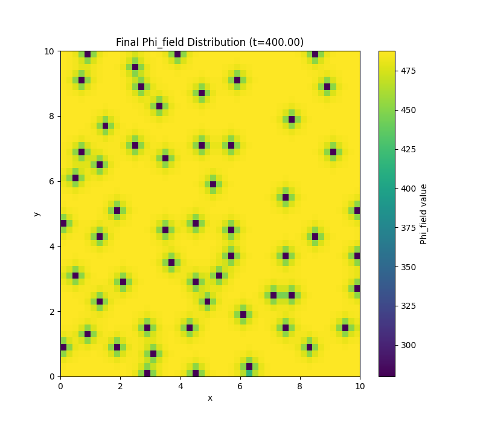

# Toy Universe - Novak Edition: A Coupled Mind-Motion (ID14) & Field-Charge (ID26) Simulation

 
<!-- Replace with an actual banner image if you have one -->

## Welcome to the Toy Universe!

This repository hosts the research, theoretical framework, simulation code, and findings for a novel computational model exploring the coupled dynamics of a hypothetical **Mind-Motion system (ID14)** and a **Field-Charge system (ID26)**. This project, spearheaded by David Novak, delves into the intricate interactions between consciousness-like fields and fundamental physical-like fields within a simulated "Toy Universe."

**Author/Originator:** David Novak
**Simulation & Analysis Support:** Cascade AI
**Date of Public Disclosure:** June 5, 2025

## Project Overview

The core of this research involves Python-based spatial simulations (initially 1D, now extended to 2D) that model:

1.  **ID14 (Mind-Motion Dynamics):** The evolution of internal variables representing Imagination (`I`), Realization (`R`), and a Consciousness Field (`Ψ_ID14`).
2.  **ID26 (Field-Charge Dynamics):** The evolution of a spatially distributed electric potential-like field (`Φ_ID26`), influenced by and influencing charge-like and motion-like entities derived from the ID14 system.

This work focuses on achieving stable, bounded, and physically plausible dynamics in a complex system featuring nonlinear feedback loops. Key aspects include:

*   **Bidirectional Coupling:** `Ψ_ID14` influences `Φ_ID26`, and `Φ_ID26` feeds back into `Ψ_ID14`.
*   **Nonlinear Feedback:** Incremental introduction and tuning of nonlinear terms in the `Φ_ID26` PDE.
*   **Saturation Mechanisms:** Implementation of `tanh` functions to prevent runaway behavior and ensure numerical stability.
*   **Parameter Exploration:** Systematic tuning of coupling constants, damping coefficients, and feedback strengths.
*   **1D Breakthrough:** Achieved a stable, high-activity oscillatory state with sustained `Φ_ID26` field growth in the 1D model, demonstrating the viability of the coupled system (see `paper.md` for details).
*   **2D Breakthrough (CPU):** Successfully extended the simulation to 2D on CPU (`id14_id26_simulation_2D_cpu.py`). Key achievements include:
    *   Attaining sustained high-amplitude growth of the `Φ_ID26` field.
    *   Observing the emergence of distinct spatial patterns (e.g., spots/peaks) by tuning saturation mechanisms and significantly reducing the diffusion coefficient (`gamma_Phi_p`). (See `project_log_2D_CPU_patterns_2025-06-06.md` for details).

    **Example 2D Simulation Results:**

    *Time Series Data (Psi_ID14 and avg(Phi_field)):*
     in 2D CPU simulation")

    *Final Spatial Pattern in Phi_field:*
    

## Key Documents & Resources

*   **`LICENSE`:** Declaration of Prior Art. This document outlines the terms under which this work is shared, emphasizing its status as publicly disclosed prior art while retaining rights for commercial application by the author.
*   **`id14_id26_simulation.py`:** The original 1D Python simulation script.
*   **`id14_id26_simulation_2D_cpu.py`:** The 2D CPU-based Python simulation script.
*   **`research.md`:** Supporting research notes and conceptual development by David Novak.
*   **`project_log_2D_CPU_patterns_2025-06-06.md`:** Log detailing breakthroughs in 2D CPU simulation leading to pattern formation.
*   **`simulation.md`:** A comprehensive research paper draft, suitable for submission, detailing 2D simulation findings and pattern emergence. Also available rendered on [GitHub Pages](https://novakdavid98.github.io/toyuniverse-novak/simulation.md).
*   **`plots/`:** This directory contains visualizations generated by the simulation, such as:
    *   `id14_id26_simulation_plot_summary.png`
    *   `id14_id26_simulation_plot_phi_heatmap.png`
    *   And any other relevant plots.
*   **`/data/` (directory, example):** If you have raw simulation output data files, they can be stored here. (You'll need to create this and add your data).

## Getting Started

1.  **Clone the repository:**
    ```bash
    git clone https://github.com/NovakDavid98/toyuniverse-novak.git
    cd toyuniverse-novak
    ```
2.  **Set up the Python environment:**
    The simulation script `id14_id26_simulation.py` requires Python 3 and the following libraries:
    *   `numpy`
    *   `scipy`
    *   `matplotlib`

    You can install them using pip:
    ```bash
    pip install numpy scipy matplotlib
    ```
3.  **Run the simulation:**
    (Ensure `id14_id26_simulation.py` is in the root directory or adjust path accordingly)
    ```bash
    python id14_id26_simulation.py # For 1D simulation
    # or
    python id14_id26_simulation_2D_cpu.py # For 2D CPU simulation
    ```
    This will generate output plots in the same directory.

4.  **Converting `simulation.md` to PDF (Optional):**
    A Python script `md_to_pdf_converter.py` is provided to convert `simulation.md` into a styled PDF document (`simulation.pdf`).
    *   **Additional Dependencies for PDF Conversion:**
        ```bash
        pip install markdown2 weasyprint
        ```
        On Linux (like Fedora), `WeasyPrint` also requires system libraries:
        ```bash
        sudo dnf install pango cairo gdk-pixbuf2 libffi-devel
        ```
    *   **Run the PDF converter:**
        ```bash
        python md_to_pdf_converter.py
        ```

## Contribution & Citation

This work is primarily for establishing prior art and for academic study. If you build upon this work, please provide appropriate attribution to David Novak.

For inquiries regarding commercial use or collaboration, please contact David Novak.

## Repository Structure (Recommended)

```
.toyuniverse-novak/
├── README.md                 # This file
├── LICENSE                   # Declaration of Prior Art
├── paper.md                  # Main research paper
├── id14_id26_simulation.py   # Python simulation script (1D)
├── id14_id26_simulation_2D_cpu.py # Python simulation script (2D CPU)
├── research.md               # Original research notes
├── project_log_2D_CPU_patterns_2025-06-06.md # Log of 2D CPU simulation findings
├── simulation.md             # Research paper draft (Markdown)
├── simulation.pdf            # Research paper draft (Generated PDF)
├── md_to_pdf_converter.py    # Script to convert simulation.md to PDF
├── requirements.txt          # (Optional: pip freeze > requirements.txt)
├── .gitignore                # (Recommended: e.g., for __pycache__/)
├── plots/                    # Generated plots
│   ├── id14_id26_simulation_plot_summary.png
│   └── id14_id26_simulation_plot_phi_heatmap.png
└── data/                     # (CREATE & ADD DATA MANUALLY)
    └── ... (simulation output files)
```

## Future Directions

Building on recent successes, future work includes:
*   **2D Pattern Characterization:** In-depth analysis of the newly observed spatial patterns in the 2D CPU simulation (stability, wavelength, type, influence of parameters like `delta_psi_d_p`).
*   **Exploring 2D Parameter Space:** Further tuning of diffusion (`gamma_Phi_p`), reaction terms, and ID14 parameters in the 2D model to understand pattern selection and achieve different dynamic regimes (e.g., patterned states with lower `Psi_ID14` oscillations).
*   **GPU Acceleration:** Adapting the 2D simulation for GPU (ROCm) to enable larger/longer simulations and more rapid parameter exploration.
*   **Numerical Refinements:** Assessing and improving grid resolution and time-stepping for sharp patterns as needed.
*   Continued investigation of the theoretical underpinnings of the observed phenomena.

--- 

*This Toy Universe is a creation of David Novak, brought to computational life with the assistance of Cascade AI.*
