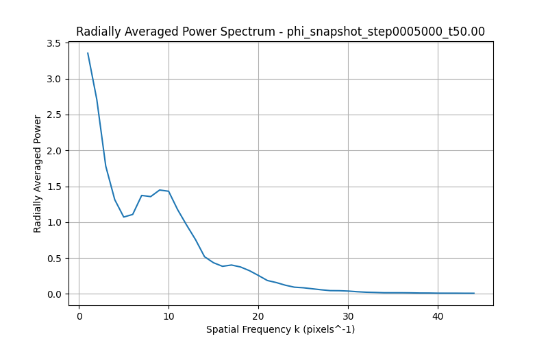
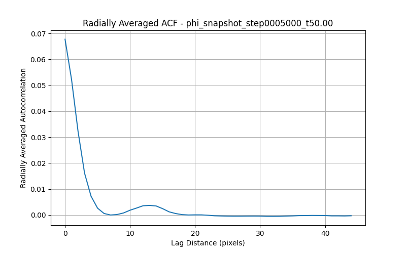

# Toy Universe - Novak Edition: A Coupled Mind-Motion (ID14) & Field-Charge (ID26) Simulation

<!--  -->
<!-- Placeholder for a project banner image if available -->

## Welcome to the Toy Universe!

This repository hosts the research, theoretical framework, simulation code, and findings for a novel computational model exploring the coupled dynamics of a hypothetical **Mind-Motion system (ID14)** and a **Field-Charge system (ID26)**. This project, spearheaded by David Novak, delves into the intricate interactions between consciousness-like fields and fundamental physical-like fields within a simulated "Toy Universe."

**Author/Originator:** David Novak
**Simulation & Analysis Support:** Cascade AI
**Last Updated:** June 8, 2025

## Project Overview

The core of this research involves Python-based spatial simulations (initially 1D, now extended to 2D) that model:

1.  **ID14 (Mind-Motion Dynamics):** The evolution of internal variables representing Imagination (`I`), Realization (`R`), and a Consciousness Field (`Ψ_ID14`).
2.  **ID26 (Field-Charge Dynamics):** The evolution of a spatially distributed electric potential-like field (`Φ_ID26`), influenced by and influencing charge-like and motion-like entities derived from the ID14 system.

This work focuses on achieving stable, bounded, and physically plausible dynamics in a complex system featuring nonlinear feedback loops. Recent efforts have concentrated on the analysis of 2D spatial patterns emerging in the `Φ_ID26` field. Key aspects include:

*   **Bidirectional Coupling:** `Ψ_ID14` influences `Φ_ID26`, and `Φ_ID26` feeds back into `Ψ_ID14`.
*   **Nonlinear Feedback:** Incremental introduction and tuning of nonlinear terms in the `Φ_ID26` PDE.
*   **Saturation Mechanisms:** Implementation of `tanh` functions to prevent runaway behavior and ensure numerical stability.
*   **Parameter Exploration:** Systematic tuning of coupling constants, damping coefficients, and feedback strengths.
*   **1D Breakthrough:** Achieved a stable, high-activity oscillatory state with sustained `Φ_ID26` field growth in the 1D model, demonstrating the viability of the coupled system (see `paper.md` for details).
*   **2D Pattern Formation & Analysis:** Extended simulations to 2D (initially CPU, then `simulation_gpu_v2.py`), observing distinct spatial patterns (labyrinths, spots). Developed a suite of Python scripts for quantitative analysis (FFT, ACF, spatial variance) to characterize these patterns and their evolution. See `comprehensive_research_summary.html` for details.

    **Example 2D Pattern Analysis Results (from `comprehensive_research_summary.html`):**

    *Labyrinth Pattern (t=20) & Spot Pattern (t=50):*
    
    

    *FFT/ACF Analysis Example (Spot Pattern t=50):*
    
    

## Key Documents & Resources

*   **`LICENSE`:** Declaration of Prior Art.
*   **`comprehensive_research_summary.html` ([View HTML](./comprehensive_research_summary.html)):** The primary, most up-to-date research summary, detailing 2D pattern analysis, methodologies, findings, and guidance for future work. Highly recommended starting point.
*   **`comprehensive_research_summary.pdf` ([View PDF](./comprehensive_research_summary.pdf)):** PDF version of the comprehensive summary (generated from the HTML).
*   **`paper.md`:** Original conceptual paper by David Novak outlining the Toy Universe model.
*   **`ToyUniverse_Research_Paper.html` & `ToyUniverse_Research_Paper_Continuation.html`:** Earlier research paper drafts, now largely superseded by the comprehensive summary but retained for historical context.
*   **`simulation_gpu_v2.py`:** The current 2D GPU-accelerated Python simulation script (can also run on CPU if CuPy is not found).
*   **Analysis Scripts:** (Located in the project root)
    *   `inspect_npy_snapshot.py`: Basic inspection of `.npy` snapshots.
    *   `qualitative_spatial_comparison.py`: Side-by-side snapshot plotting.
    *   `analyze_labyrinth_decay.py`: Spatial variance analysis for labyrinth patterns.
    *   `inspect_labyrinth_spike_snapshots.py`: Visualization of labyrinth instability.
    *   `analyze_single_snapshot_fft_acf.py`: FFT and ACF analysis for single snapshots.
*   **Utility Scripts:**
    *   `generate_pdf_report.py`: Converts HTML reports (like the comprehensive summary) to PDF using WeasyPrint.
*   **`plots/`:** General directory for miscellaneous plots.
*   **`analysis_results/`:** Directory where analysis scripts save their output (plots, data). Organized by analysis type (e.g., `labyrinth_t20_fft_acf/`, `spot_t50_fft_acf/`).
*   **Snapshot Data Directories:**
    *   `run_labyrinth_snapshots_v2/phi_snapshots_npy/`: Raw `.npy` data for labyrinth simulations.
    *   `run_spot_snapshots_v2/phi_snapshots_npy/`: Raw `.npy` data for spot simulations.

## Getting Started

1.  **Clone the repository:**
    ```bash
    git clone https://github.com/NovakDavid98/toyuniverse-novak.git
    cd toyuniverse-novak
    ```
2.  **Set up the Python environment:**
    Python 3 is required. Key libraries include:
    *   `numpy`
    *   `scipy`
    *   `matplotlib`
    *   `argparse` (for script arguments)
    *   `cupy` (optional, for GPU acceleration in `simulation_gpu_v2.py`)
    *   `weasyprint` (for `generate_pdf_report.py`)

    It's recommended to use a virtual environment. You can install dependencies using pip:
    ```bash
    pip install numpy scipy matplotlib argparse cupy weasyprint
    # Note: CuPy installation can be complex and depends on your CUDA version.
    # WeasyPrint may require additional system dependencies (see WeasyPrint documentation).
    ```
    A `requirements.txt` file can be generated if needed: `pip freeze > requirements.txt`.

3.  **Run Simulations:**
    The primary 2D simulation script is `simulation_gpu_v2.py`. Parameters are typically set within the script.
    ```bash
    python simulation_gpu_v2.py
    ```
    Snapshots are saved to directories like `run_spot_snapshots_v2/phi_snapshots_npy/`.

4.  **Run Analysis Scripts:**
    Refer to the `comprehensive_research_summary.html` (Section 6.2) or the scripts themselves for usage instructions. Examples:
    ```bash
    # Analyze a single spot snapshot
    python analyze_single_snapshot_fft_acf.py run_spot_snapshots_v2/phi_snapshots_npy/phi_snapshot_step0005000_t50.00.npy analysis_results/spot_t50_fft_acf/

    # Analyze labyrinth decay
    python analyze_labyrinth_decay.py run_labyrinth_snapshots_v2/phi_snapshots_npy/ analysis_results/labyrinth_decay/
    ```

5.  **Generate PDF Report:**
    To convert `comprehensive_research_summary.html` to PDF:
    ```bash
    python generate_pdf_report.py comprehensive_research_summary.html comprehensive_research_summary.pdf
    ```
    Ensure WeasyPrint and its dependencies are installed.

## Contribution & Citation

This work is primarily for establishing prior art and for academic study. If you build upon this work, please provide appropriate attribution to David Novak.

For inquiries regarding commercial use or collaboration, please contact David Novak.

## Repository Structure

```
.toyuniverse-novak/
├── README.md                           # This file
├── LICENSE                             # Declaration of Prior Art
|
├── comprehensive_research_summary.html # Main HTML research report (START HERE)
├── comprehensive_research_summary.pdf  # PDF version of the report
|
├── simulation_gpu_v2.py                # Main 2D simulation script (GPU/CPU)
|
├── # --- Analysis Scripts --- #
├── analyze_single_snapshot_fft_acf.py
├── analyze_labyrinth_decay.py
├── inspect_labyrinth_spike_snapshots.py
├── inspect_npy_snapshot.py
├── qualitative_spatial_comparison.py
|
├── # --- Utility Scripts --- #
├── generate_pdf_report.py              # Converts HTML to PDF
|
├── # --- Core Research Documents (Historical/Supporting) --- #
├── paper.md                            # Original conceptual paper
├── ToyUniverse_Research_Paper.html       # Earlier HTML research paper
├── ToyUniverse_Research_Paper_Continuation.html # Continuation of earlier paper
├── research.md                         # Original research notes by D. Novak
├── project_log_*.md                    # Various project log files
|
├── # --- Data and Results --- #
├── run_spot_snapshots_v2/
│   └── phi_snapshots_npy/              # Raw .npy snapshots for spot patterns
├── run_labyrinth_snapshots_v2/
│   └── phi_snapshots_npy/              # Raw .npy snapshots for labyrinth patterns
├── analysis_results/                   # Output from analysis scripts (plots, data)
│   ├── spot_t50_fft_acf/
│   ├── labyrinth_t20_fft_acf/
│   └── ...
├── plots/                              # General plots directory
|
├── requirements.txt                    # (Recommended: pip freeze > requirements.txt)
└── .gitignore                          # (Recommended)
```

## Future Directions & Next Steps

With the current phase of spatial pattern analysis (labyrinths and spots) documented, key future directions include:

1.  **Comparative ID14 Dynamics Analysis:** As prioritized, investigate the differences in ID14 system variable dynamics (e.g., `I`, `R`, `Psi_ID14`, `Psi_c`, `Psi_d`) between the labyrinth-forming and spot-forming simulation runs. This involves:
    *   Extracting and plotting time series of these ID14 variables from both simulation types.
    *   Analyzing average values, amplitudes, frequencies, and correlations.
    *   Relating these ID14 dynamics to the observed stability and characteristics of the `Φ_ID26` spatial patterns.
    *   A new script may be needed for this comparative analysis, potentially leveraging parts of existing plotting or data extraction logic.

2.  **Parameter Sweeps (Refined):** Based on insights from the `ToyUniverse_Research_Paper_Continuation.html` (which details `gamma_Phi_PDE` and `delta_psi_d_p` sweeps), conduct further targeted parameter explorations if specific hypotheses arise from the ID14 dynamics comparison.

3.  **Long-Term Stability of Spots:** While spots are more stable than the analyzed labyrinths, their long-term evolution towards disorder warrants further investigation if perfectly stable or oscillating spot lattices are a goal.

4.  **GPU Simulation Enhancements (`simulation_gpu_v2.py`):**
    *   Implement more robust parameter input (e.g., config files or command-line arguments) instead of hardcoding.
    *   Enhance logging and output options for ID14 variables alongside `Φ_ID26` snapshots.

5.  **Theoretical Integration:** Continue to integrate simulation findings with the theoretical framework of the Toy Universe model, refining hypotheses and understanding of the underlying mechanisms.

6.  **Repository Maintenance:**
    *   Ensure all generated plots referenced in `comprehensive_research_summary.html` are correctly located or paths are updated.
    *   Periodically regenerate `comprehensive_research_summary.pdf` if the HTML version is updated.
    *   Commit and push all new scripts, reports, and the updated README to the GitHub repository.

--- 

*This Toy Universe is a creation of David Novak. Simulation, analysis, and documentation support provided by Cascade AI.*
